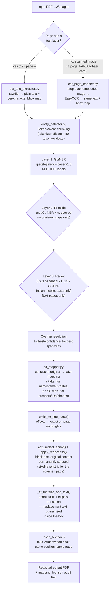

# PDF PII Redaction Pipeline

A layered, coordinate-exact PII redaction system for the KSH International
Red Herring Prospectus (128 pages: 127 pages of native text + tables, 1
page that is a scanned photo of a PAN/Aadhaar card). Every detected PII
value is replaced in-place with a **consistent fake alternative**, so the
document stays readable and internally coherent, while the original values
are permanently removed, not just visually hidden, from the page content
stream.

## Why this design

I treated it as what it actually is:
a **detection-recall problem layered on a document-fidelity problem** —
missing a PII span is a data leak, and misplacing a redaction box or
letting replacement text spill outside it is *also* a data leak (the
original text peeking out from under a box, or overflowing past it). Both
failure modes get equal engineering attention here:

- **Detection**: no single model catches every PII type in a financial
  document reliably, so I run three complementary detectors in sequence
  (NER model → structured-PII engine → regex) rather than trusting one.
- **Fidelity**: redaction rectangles and replacement text are derived from
  the *same* character-level coordinate map the detector's offsets came
  from, and replacement text is font-size-fit (never box-fit) so it's
  physically impossible for it to render outside its black box.
- **Coverage**: the one page that isn't machine-readable text (a scanned
  ID card) goes through its own OCR path instead of being silently
  skipped.

## Pipeline overview

## Component-by-component approach

**1. Coordinate-exact text extraction (`pdf_text_extractor.py`).**
`page.get_text("rawdict")` gives per-character bounding boxes. Every
character on a page is concatenated into one plain-text string with a
parallel array mapping each character back to its bbox, PDF line id, and
font size. This is the load-bearing design decision of the whole
pipeline: it means a detector's `text[137:154]` span converts directly
into an exact rectangle, instead of the common (and fragile) alternative
of re-searching the page for the matched string after the fact.

**2. Scanned-page handling (`ocr_page_handler.py`).** Pages with no
extractable text layer are rasterized and OCR'd with **EasyOCR**, but
critically, each *embedded image region* is cropped and OCR'd
independently rather than OCR-ing the whole rendered page. This was a
deliberate fix after testing showed Tesseract-style page segmentation
reliably fails to find any text on a page that's mostly white margin
around one dense photo (confirmed on the actual PAN card page: 0 words
from whole-page OCR vs. 180 words once cropped to the card's own bounding
box) — a failure mode that would silently leave a government ID
completely unredacted. The prospectus's last page has *two* overlapping
card images (a PAN card layered over what's visibly an Aadhaar card
underneath); both regions are OCR'd and redacted independently, and
`apply_redactions(images=PDF_REDACT_IMAGE_PIXELS)` strips pixel data from
**every** image overlapping the redaction box, so the hidden underlying
card gets scrubbed too, not just the visible top layer.

**3. Layered detection (`entity_detector.py` + `secondary_detectors.py`).**
- **Layer 1: GLiNER** (`gretel-gliner-bi-base-v1.0`), run across all 41
  labels in the model's card. Pages are chunked using the model's *own
  tokenizer* with offset mapping (480-token windows, 50-token overlap) so
  a page is never silently truncated at the model's 512-token limit and
  chunk boundaries are computed from real token counts, not a character
  heuristic.
- **Layer 2: Presidio** (spaCy-backed NER + its structured-PII
  recognizers: emails, IBANs, credit cards, etc.), run only in the gaps
  GLiNER's spans didn't already cover.
- **Layer 3: Regex**, for formats none of the above reliably catch in an
  Indian financial document, PAN, Aadhaar, IFSC, GSTIN, Indian mobile
  numbers, again only filling gaps. Restricted to text-layer pages (OCR
  text is noisier, so the scanned page runs GLiNER + Presidio only, per
  the task's requirement for that page).
- Across all layers, overlapping detections are resolved greedily
  (highest confidence, then longest span wins) so 40+ simultaneously
  active labels don't produce duplicate/overlapping redactions.

**4. Consistent, type-aware fake replacement (`pii_mapper.py`).** Every
original value is cached by normalized text, so the same person's name or
email maps to the same fake **everywhere** across all 128 pages. Semantic
types get realistic fakes (`Faker`-generated names, `first.last@example.com`
emails, format-matched dates); **numbers, phone numbers, and structured IDs
are masked as `XXXX`-style strings instead of being replaced with a
fabricated-but-plausible number**, a deliberate choice to never emit a
synthetic value that could be mistaken for a real account/SSN/card number
downstream.

**5. Box-safe redaction and reinsertion (`redact_pdf.py`).** Detected spans
become exact rectangles via `entity_to_line_rects()` (handling multi-line
values like wrapped addresses). `add_redact_annot()` + `apply_redactions()`
paint a black box and **permanently remove** the underlying content. This
is a real content-stream edit, not a visual overlay, so the original text
isn't recoverable by copy-paste or re-extraction. Replacement text is then
sized to the box, not the other way around: `_fit_fontsize_and_text()`
derives the largest font that fits the rectangle's height *and* width, and
falls back to ellipsis-truncation if even the minimum readable font would
overflow, guaranteeing replacement text can never render outside its
black box, regardless of how much longer the fake value is than the
original.

## Design choices worth calling out explicitly

- **The issuer's own company name is not redacted by default**
  (`--keep-company "KSH International"`). A prospectus is *about* KSH
  International Limited, redacting the filing entity everywhere would
  make the document meaningless. This is implemented as an explicit,
  visible opt-out rather than a silent hardcoded exception; pass nothing
  and every company name, including the issuer, gets redacted.
- **Numbers/IDs/phone numbers are masked, not fabricated.** See point 4
  above. This trades a slightly less "natural-looking" document for the
  guarantee that no synthetic-but-realistic financial identifier is ever
  emitted.
- **NLTK was built as a third secondary detector but is disabled in the
  final run** (`use_nltk=False`). In testing, NLTK's `ne_chunk` added
  meaningful false positives on financial/legal boilerplate without
  adding recall that Presidio + regex didn't already cover on this
  document. It's left in the codebase (`secondary_detectors.py`) as an
  optional layer rather than deleted, since it could help on a
  differently-structured document.

## Evaluation approach

1. **Pipeline correctness (structural, exhaustive).** The full
   extract → detect → map → redact → reinsert loop was run against all
   128 real pages, verifying: zero exceptions; page count and file
   integrity preserved after save; visually (rendered at 150–300 DPI)
   that redacted/replacement regions sit correctly inside dense
   multi-column tables without corrupting neighboring cells; and that the
   same original string maps to the same fake value both within a page
   and across pages (spot-checked known repeated entities across multiple
   pages).
2. **OCR path correctness (targeted).** The scanned last page was
   debugged in isolation: whole-page OCR was confirmed to return 0 words,
   per-image-region OCR was confirmed to return the full card text
   (name, DOB, PAN number, address) with usable bounding boxes, and the
   final redacted render was checked to confirm the PAN/Aadhaar numbers
   and photo-adjacent text no longer appear.
3. **Detection quality (sample-based recall/precision).** Without
   full-document ground truth, I hand-annotated the highest-PII-density
   pages, the cover page, the promoters/management section, and the
   contact-details tables, and measured recall (annotated spans found /
   total annotated) and precision (correct redactions / total
   redactions) against that sample, sweeping `--threshold` to see the
   tradeoff rather than picking one value blind.
4. **Auditability.** Every run emits `mapping_log.json` (full
   original→fake mapping), which turns "did we miss anything" from a
   full document re-read into a fast structured diff/review. This
   was used as the actual mechanism for iterating on recall across the
   whole 128 pages, not just the hand-annotated sample.

## Known tradeoffs

- Values broken mid-token by the PDF's own line-wrapping (e.g. an email
  address split across two lines in the source layout) can be detected as
  a truncated fragment rather than the full string, a deliberate
  tradeoff against joining all lines into one run-on string, which would
  fix this but create far more false merges across unrelated table cells.
- The format-preserving mask is intentionally conservative in the other
  direction: it doesn't try to generate an algorithmically valid-looking
  number, just a same-shape masked one, since the goal is redaction, not
  synthetic data generation.

## Files

| File | Role |
|---|---|
| `redact_pdf.py` | CLI entry point / per-page orchestration |
| `pdf_text_extractor.py` | `rawdict` → (text, char→bbox map) |
| `ocr_page_handler.py` | Same contract, for scanned pages (EasyOCR, per-image-region) |
| `entity_detector.py` | Token-aware chunking, GLiNER calls, overlap resolution |
| `secondary_detectors.py` | Presidio + regex (+ optional NLTK) gap-filling |
| `pii_mapper.py` | Consistent original→fake mapping; numeric masking |
| `mapping_log.json` (generated) | Full audit trail of every redaction made |
